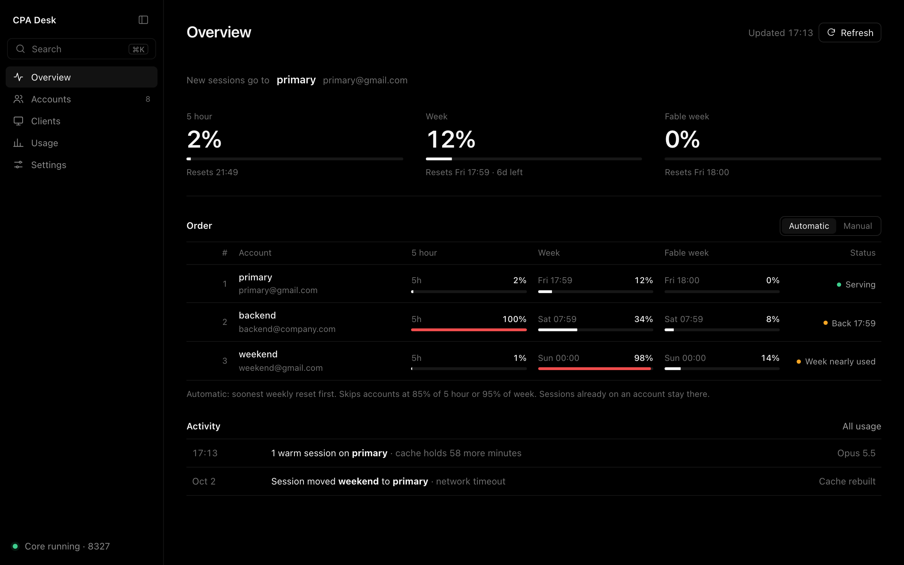
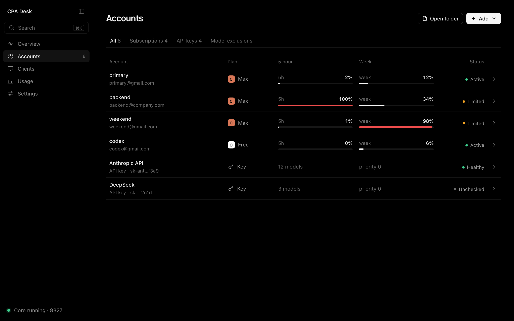
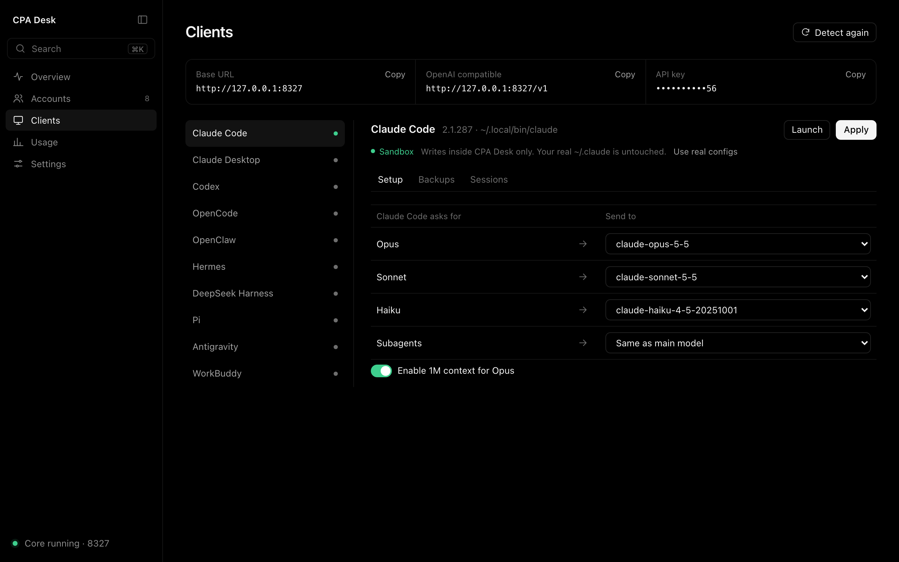

# CPA Desk

A personal fork of [EasyCLIProxyAPI](https://github.com/router-for-me/EasyCLIProxyAPI), the
desktop console for CLIProxyAPI. It runs several Claude subscriptions behind one local endpoint
and tries hard to keep each session on the same account, because Anthropic prompt caches are per
account and every move rebuilds the cache.

It ships a patched proxy core from
[rafay99-epic/CLIProxyAPI](https://github.com/rafay99-epic/CLIProxyAPI).

| | |
| --- | --- |
| App base | upstream EasyCLIProxyAPI `90364e9` (v0.3.12) |
| Core | CLIProxyAPI v8.0.6 + fork patches (`8.0.6-rafay.1`, pinned in `core.ref`) |
| Platform | macOS, Apple silicon |
| Bundle id | `com.rafay.cpadesk` (installs next to upstream, own data dir) |



## What changed

### Routing and sessions

- **Reset-first routing.** Claude accounts are ordered by the soonest weekly reset (Automatic)
  or by a dragged order (Manual). Accounts at 85% of their 5 hour limit or 95% of their week are
  skipped.
- **Warm sessions stay put.** Reordering only changes where new sessions go. A session already
  on an account keeps it.
- **Patched core.** Network errors, 5xx and 529 overloaded are retried on the same account
  before the session moves, and config reloads keep session bindings. Details in the
  [core fork](https://github.com/rafay99-epic/CLIProxyAPI).
- **New defaults.** Fill-first routing, session affinity on with a 70 minute TTL, and
  `save-cooldown-status: true`.
- **Session activity.** Warm sessions and account moves (with the reason) are read from the
  core log and shown in the app.

### Limits

- 5 hour, week and Fable week usage per account, with reset times, from the usage endpoint and
  response headers.

### Menu bar

- Live gauge glyph that fills with the serving account's weekly usage and shows when the core
  is stopped.
- Popover with every account's 5 hour and week limits, warm sessions, launch at login, open,
  copy URL, restart core and quit.
- The Dock icon is hidden while the window is closed.

### Safer client setup

- Agent configs (Claude Code, Codex and the rest) are written to a sandbox home inside CPA Desk
  until you switch on real configs. Your `~/.claude` and `~/.codex` stay untouched by default.
- One-step import from EasyCLIProxyAPI: accounts, GUI and core config, usage history and the
  Codex model catalog. It refuses while the old app or core is running, stages the copy before
  swapping it in, backs up CPA Desk's old data and only reads the source files.

### Updates and releases

- In-app updates from this fork's GitHub Releases: checked at launch and every 6 hours,
  downloaded and signature-checked in the background, installed when you click Restart.
- The core updates only with CPA Desk releases. Upstream core downloads are disabled.
- Every push to `main` that touches the app builds the patched core and the app, signs the
  update and publishes the next version with notes written from the commits.
- A separate Dev build (`com.rafay.cpadesk.dev`, port 8337) with the sandbox locked on, for
  testing without touching the installed app.

## UI changes

The whole app was reskinned and the main pages were rebuilt.

- **Look.** True black background, white text, hairline borders, no card chrome. Gauge app icon.
- **Shell.** Collapsible sidebar with Overview, Accounts, Clients, Usage and Settings, a
  `⌘K` command palette, and the core status in the footer.
- **Window.** The gray macOS title bar is gone. The app runs to the top edge, the window
  controls sit inside the sidebar, and the top strip stays draggable.
- **Overview (new).** Which account takes new sessions, 5 hour, week and Fable week meters with
  reset times, the routing order with an Automatic or Manual toggle, and a session activity feed.
- **Accounts (new).** One table for subscriptions and API keys with plan, 5 hour and week usage
  and status. Tabs for Subscriptions, API keys and Model exclusions, and a detail sheet per
  account.
- **Clients (new).** Base URL, OpenAI-compatible URL and API key in one copy strip. Per-client
  model mapping, a sandbox indicator, and Setup, Backups and Sessions tabs.
- **Settings (new).** Rebuilt in the new layout, including Versions and Restart for updates.
- **Usage and the other upstream pages** keep their behavior and are restyled to match.





## Security

Security follows upstream. This fork has no separate security policy.

- Security fixes from upstream
  [EasyCLIProxyAPI](https://github.com/router-for-me/EasyCLIProxyAPI) and
  [CLIProxyAPI](https://github.com/router-for-me/CLIProxyAPI) are always ported into this fork
  by hand. Other upstream changes are taken only when wanted.
- Report vulnerabilities in upstream code to the upstream project. Issues are turned off on
  this fork.
- Updates are signed with this fork's own key. The public key is in `src-tauri/tauri.conf.json`,
  and installed copies reject anything not signed with it.

## Install

Download the latest release from
[Releases](https://github.com/rafay99-epic/EasyCLIProxyAPI/releases/latest). Versions from 1.0.0
on update themselves.

## Build

```sh
./build-desk.sh dev     # build the core from ../cpa-core, then build and install CPA Desk Dev
./build-desk.sh prod    # build the release app locally (not installed)
```

Maintainer notes (Prod and Dev builds, porting upstream changes, release signing) are in
[FORK.md](FORK.md).

## Upstream docs

Everything not listed above (OAuth providers, API providers, protocol conversion, usage
analytics, agent clients) works as upstream documents it in the
[EasyCLIProxyAPI README](https://github.com/router-for-me/EasyCLIProxyAPI#readme).
[简体中文](README.zh-CN.md) and [日本語](README.ja.md) translations describe upstream.

## License

MIT, see [LICENSE](LICENSE). Original work by Router-For.ME.
